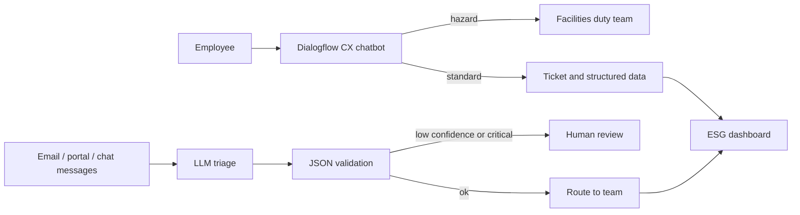

# ESG Analytics: RPA, AI and Cloud (Assessment 3)

Evidence repository for BUS5001 Assessment 3. It contains the Q3 LLM triage experiment, the Q4 NotebookLM experiment log and the written report. The Q1 Dialogflow chatbot is built in the Google Cloud console and documented in the report.

> New here? Follow [STEP_BY_STEP_GUIDE.md](STEP_BY_STEP_GUIDE.md) for the full walkthrough of every question.

## Repository layout

```
esg-assessment3/
├── README.md
├── STEP_BY_STEP_GUIDE.md          # how to complete each question
├── report/
│   ├── Assessment3_Report.md      # full report draft (Q1 to Q4)
│   └── build_docx.py              # converts the report to Word
├── q3/                            # LLM-based ESG message triage
│   ├── messages.json              # sample ESG messages
│   ├── prompt_v1_original.txt     # prompt supplied in the brief
│   ├── prompt_v2_revised.txt      # critiqued and improved prompt
│   ├── triage.py                  # runs LLM, rule-based and zero-shot classifiers
│   ├── requirements.txt           # only for the zero-shot baseline
│   └── results/                   # created when you run triage.py
└── q4/
    └── experiment_log.md          # NotebookLM experiment log template
```

## Quick start

### Q3: run the triage experiment

```bash
cd q3

# 1. Rule-based baseline (no dependencies)
python3 triage.py --modes rules

# 2. Add an open-source LLM through any OpenAI-compatible endpoint, for example Ollama:
#    ollama pull llama3.1:8b
export LLM_BASE_URL=http://localhost:11434/v1
export LLM_MODEL=llama3.1:8b
python3 triage.py --modes rules,llm

# 3. Add the Hugging Face zero-shot baseline
pip install -r requirements.txt
python3 triage.py --modes rules,llm,zeroshot
```

Outputs:

| File | Content |
|---|---|
| `results/comparison.md` | Side-by-side table of category, urgency and team per method |
| `results/<mode>_results.json` | Parsed output per message |
| `results/llm_run_log.jsonl` | Raw LLM text, latency and schema problems (use as evidence) |

To use a hosted API instead, set `LLM_BASE_URL`, `LLM_MODEL` and `LLM_API_KEY` in your shell. Never commit keys.

### Report: build the Word document

```bash
pip install python-docx
python3 report/build_docx.py     # writes report/Assessment3_Report.docx
```

### Q4: NotebookLM

Run each experiment in NotebookLM, then record prompts, outputs, accuracy checks and screenshots in `q4/experiment_log.md`.

## Architecture overview (Q1 and Q3)



## Before you submit: marking checklist

The brief says stronger submissions show practical evidence, link tools to ESG decisions, discuss privacy and ethics, and are professional. Use this to check each point.

### Q1 (17 marks)
- [ ] One clearly defined use case and five functionalities, each with a reason it matters for ESG
- [ ] Ethics section names specific risks and a design response for each (privacy, consent, minimisation, oversight, bias, escalation)
- [ ] Dialogflow screenshots: flow, 3 to 5 intents with training phrases, custom entity, form parameters, condition route, fallback handlers
- [ ] Conversation map diagram and two transcripts (one normal, one fallback)
- [ ] Explanation of your design thinking, not just screenshots
- [ ] Accessibility section (1 mark) with concrete features
- [ ] Demo video under 2 minutes, Stream link works, teaching team has access
- [ ] Short conceptual note on ticketing, notification and dashboard integration

### Q2 (8 marks)
- [ ] Real incident from the last five years, answering what, who, which data and root cause
- [ ] Diagram, SaaS / PaaS / IaaS classification and a shared responsibility table
- [ ] Three to five prevention steps that name actual cloud tools or features
- [ ] Facts verified against primary sources and cited

### Q3 (7 marks)
- [ ] Critique of the original prompt, then a revised prompt
- [ ] JSON output for two or three messages (from a real run)
- [ ] Comparison with baseline: consistency, errors and bias
- [ ] Readiness judgement covering hallucination, data protection, escalation and oversight
- [ ] Azure architecture with components and how they connect

### Q4 (8 marks)
- [ ] Features identified, each tied to an academic activity
- [ ] Each feature demonstrated with prompt and screenshot
- [ ] Accuracy, usefulness and limitations scored with evidence (for example 10 claims checked per output)
- [ ] Logs committed to this repository

### Submission
- [ ] Every `[TODO]` in the report is replaced or removed
- [ ] GitHub repository link included and accessible to the teaching team
- [ ] APA 7 references; URLs checked
- [ ] AI acknowledgement completed (this assessment is in the AI Exploration category)
- [ ] Report reads as your own work: reword drafts, add your own screenshots and findings

## Notes

- The report draft contains structure, design and analysis. Results that depend on tools you have to run yourself (Dialogflow, the LLM, NotebookLM) are left as `[TODO]` placeholders. Do not submit invented results.
- The only results included are from the rule-based baseline, which was run on the sample messages.
- Check current NotebookLM features and Snowflake incident facts against the cited sources, as both change.
