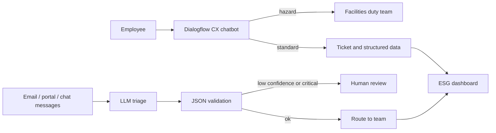

# ESG Analytics: RPA, AI and Cloud (Assessment 3)

Evidence repository for BUS5001 Assessment 3. It holds the Q3 LLM triage experiment, the Q4 NotebookLM experiment log and outputs, and the written report. The Q1 Dialogflow CX chatbot is built in the Google Cloud console and documented in the report, with screenshots in `screenshots/`.

## Repository layout

```
esg-assessment3/
├── README.md
├── screenshots/                   # Q1 Dialogflow screenshots and Q2/Q3 diagrams
├── report/
│   ├── Assessment3_Report.md      # full report (Q1 to Q4)
│   ├── Assessment3_Report.docx    # Word version of the full report
│   ├── Assessment3_Report_Short.docx  # condensed Word version
│   ├── build_docx.py              # converts the report to Word (--short for the condensed copy)
│   ├── shorten.py                 # builds the condensed text
│   └── make_q2_diagrams.py, make_q3_diagram.py  # diagram generators
├── q3/                            # LLM-based ESG message triage
│   ├── messages.json              # sample ESG messages
│   ├── prompt_v1_original.txt     # prompt supplied in the brief
│   ├── prompt_v2_revised.txt      # critiqued and improved prompt
│   ├── triage.py                  # runs LLM, rule-based and zero-shot classifiers
│   ├── requirements.txt           # only for the zero-shot baseline
│   └── results/                   # rules, LLM (3 runs), zero-shot and original-prompt outputs, run log
└── q4/                            # NotebookLM evaluation
    ├── experiment_log.md          # prompts, outputs, accuracy checks and scores
    ├── outputs/                   # exported briefing, audio transcript, mind map, flashcards
    └── screenshots/               # NotebookLM evidence
```

The four public source PDFs used in Q4 are not stored here; the report lists them with publisher, year and URL.

## Q3: run the triage experiment

```bash
cd q3

# 1. Rule-based baseline (no dependencies)
python3 triage.py --modes rules

# 2. LLM through any OpenAI-compatible endpoint, for example a hosted API or a local Ollama model
export LLM_BASE_URL=http://localhost:11434/v1
export LLM_MODEL=llama3.1:8b
python3 triage.py --modes rules,llm

# 3. Hugging Face zero-shot baseline
pip install -r requirements.txt
python3 triage.py --modes rules,llm,zeroshot
```

The reported runs used `gpt-4o-mini` at temperature 0. Set `LLM_BASE_URL`, `LLM_MODEL` and `LLM_API_KEY` in your shell; keys are never committed.

| Output | Content |
|---|---|
| `results/comparison.md` | Side-by-side table of category, urgency and team per method |
| `results/<mode>_results.json` | Parsed output per message |
| `results/llm_run_log.jsonl` | Raw LLM text, latency and schema problems |

## Q4: NotebookLM

`q4/experiment_log.md` records the sources, each prompt, the generated output, the claim-by-claim accuracy checks against the source pages, usefulness scores and limitations. Exports and screenshots are in `q4/outputs/` and `q4/screenshots/`.

## Report: build the Word documents

```bash
pip install python-docx pillow
python3 report/build_docx.py            # full report
python3 report/build_docx.py --short    # condensed report
```

## Architecture overview (Q1 and Q3)



## Notes

- Q3 results (rules, LLM, zero-shot, original prompt) are from real runs of `triage.py` on the five sample messages. Five messages illustrate behaviour and are not a measured accuracy score.
- The Q1 integration with ticketing and dashboards is conceptual and not built in the prototype.
